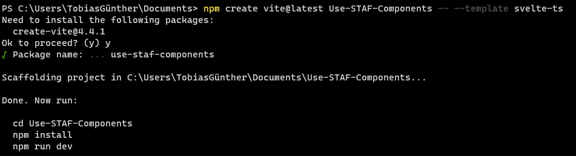
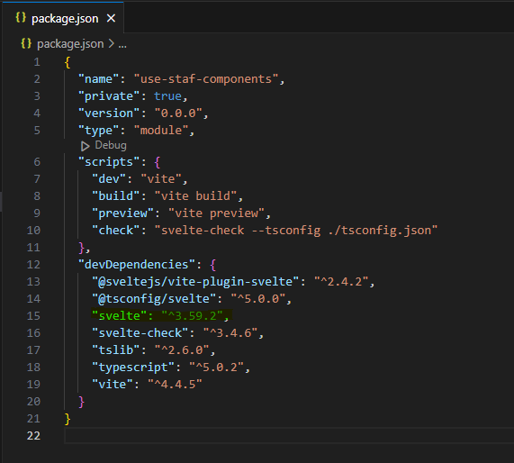

# Hvordan få STAF sitt Svelte komponentbibliotektet til å fungere

Dette repoet inneholder info rundt oppsett at et nytt Svelte prosjekt som benytter STAF sitt eksisterende Svelte komponentbibliotek.
"Out-of-the-Box" fungerer ikke biblioteket som tiltenkt, slik at noen tiltak må gjøres for å få ting til å fungere.

## Steg 1:

Sett opp ett nytt Svelte prosjekt, med TypeScript, som vist.

```
npm create vite@latest <PROJECT NAME> -- --template svelte-ts
```



## Steg 2:

Endre Svelte versjonen til `^3.59.2` som vist under (STAF komponentene baserer seg på en eldre versjon av Svelte).



## Steg 3:

Installer STAF komponentene ved å kjøre:

```
npm install --save svelte @statsforvalteren/staf-komponentbibliotek-svelte
```

## Steg 4:

Slik npm-pakken til STAF komponentene er satt opp per dags dato, vil komponentene ikke få med noe styling. Derfor må FMFA's egen bootstrap-theme også installeres. Kjør følgende kommando:

```
npm install @netlifedesign/fmfa-bootstrap-theme
```

## Steg 5:

Legg til en av STAF komponentene inn i prosjektet. Koden under er for en Modal.

```
<script lang="ts">
	import {
		Button,
		Modal,
		ModalBody,
		ModalFooter,
		ModalHeader
	} from '@statsforvalteren/staf-komponentbibliotek-svelte';
	let open = false;
	const toggle = () => (open = !open);
	import '@netlifedesign/fmfa-bootstrap-theme/custom.css';
</script>

<div>
	<Button color="danger" on:click={toggle}>Open Modal</Button>
	<Modal isOpen={open} {toggle}>
		<ModalHeader {toggle}>Modal title</ModalHeader>
		<ModalBody>
			Lorem ipsum dolor sit amet, consectetur adipisicing elit, sed do eiusmod tempor incididunt ut
			labore et dolore magna aliqua.
		</ModalBody>
		<ModalFooter>
			<Button color="primary" on:click={toggle}>Do Something</Button>
			<Button color="secondary" on:click={toggle}>Cancel</Button>
		</ModalFooter>
	</Modal>
</div>
```

## Merknader:

- `import '@netlifedesign/fmfa-bootstrap-theme/custom.css'` må inkluderes for å få med styling. Denne kan også fylles til root komponenten hvor den deretter gjelder for hele applikasjonen
- Husk å import STAF komponenter ved å bruke `@statsforvalteren/staf-komponentbibliotek-svelte`.
- I noen komponenter fungerer ikke styling 100%.
